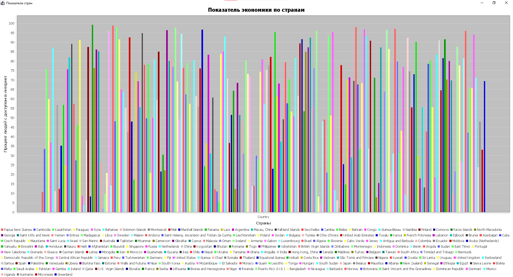
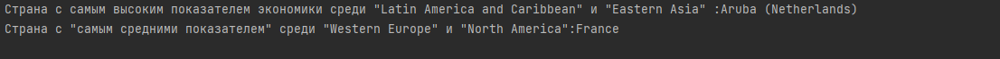

# Ход работы по проекту Вариант 1

1.Разработал набор классов  с необходимым составом полей и методов для хранения и обработки всех данных, хранящихся в CSV-файле моего варианта задания.

2.Создать файл БД SQL Lite и подключить ее к проекту.

3.Распарсив данные в файле CSV, сохранил во воременную таблицу в БД

4.В БД из временной таблицы перенёс данные в созданные по 3 Нормально форме таблицы, согласно набору обьектов

5.Сделал набор SQL-запросов к БД согласно своему варианту задания.

6.Полученные данные вывел в текстовом виде в консоль, сделать скриншоты всех полученных данных.

&nbsp;&nbsp;&nbsp;&nbsp;1 Задание

&nbsp;&nbsp;&nbsp;&nbsp;2 и 3 задания

